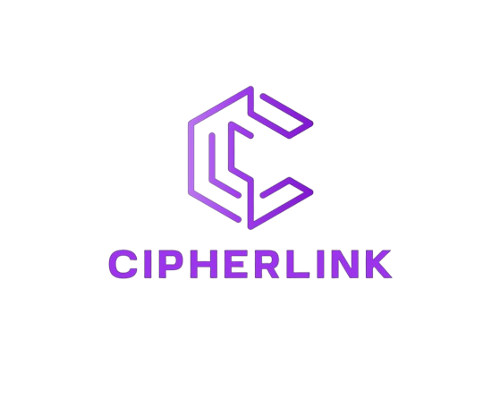
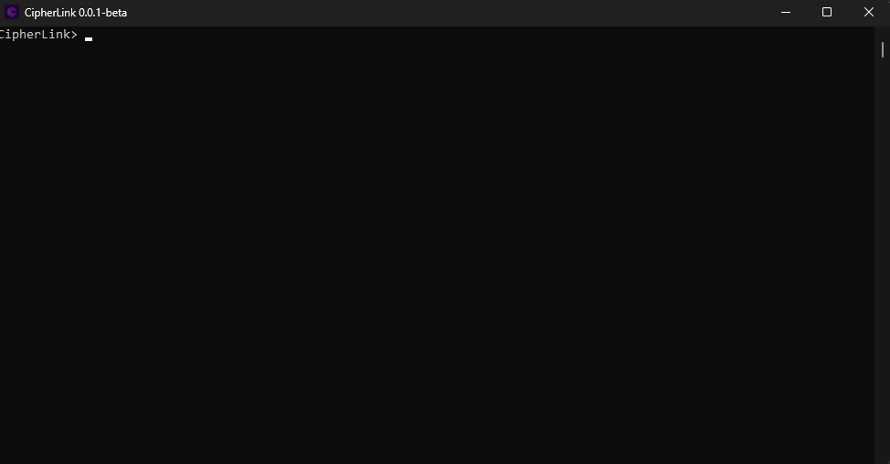

<p align="center"></p>
<div align="center" style="margin-top: 0;">
   <h1>CipherLink</h1>
   <p>All-In-One tools for torrents, piracy, automated account creation, and more. ⚡</p>
</div>
<em><h5 align="center">(Programming Language - C#)</h5></em>
<p align="center">
<a href="#"></a>
<a href="#"></a>
<a href="#"></a>
<a href="https://github.com/RussianCatt/CipherLink/issues"></a>
<p align="center"></p>


<p align="center"></p>

## 📄 Description

CipherLink is a versatile toolset designed for torrent management, piracy-related tasks, automated account creation, and more. Its modular architecture allows for easy extension because the code is easy to understand.

OUTDATED - WAIT FOR A NEW IMPLEMENTATION FOR THE PLUGIN

## 🔧 Installation

1. **Download the latest release** from the [Releases](https://github.com/RussianCatt/CipherLink/releases) tab.
2. **Extract the contents** to your desired directory.
3. **Run the executable** to start the application.

**Building from source:**

Clone the repository and build it using your preferred C# IDE (e.g., Visual Studio).

```shell
git clone https://github.com/RussianCatt/CipherLink.git
cd CipherLink
# Open and build the project in Visual Studio or use dotnet CLI
```

## 🚀 Usage

After starting the application, you can use the command line interface to interact with the plugins. Use the `help` command to see available commands and their descriptions.


## 🛠️ License

This project is licensed under the MIT License - see the [LICENSE](LICENSE) file for details.

## 🌟 Acknowledgements

Special thanks to all contributors and open-source libraries that made this project possible.

---

<p align="center">
Made with ❤️ by  <a href="https://github.com/RussianCatt/">RussianCat</a> with the help of <a href="https://github.com/stxfi/">stxfi</a>
</p>
